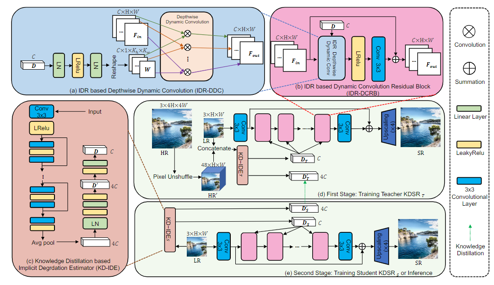

# KDSR-GAN

This project is the official implementation of 'Knowledge Distillation based Degradation Estimation for Blind Super-Resolution', ICLR2023
> **Knowledge Distillation based Degradation Estimation for Blind Super-Resolution [[Paper](https://arxiv.org/pdf/2211.16928.pdf)] [[Project](https://github.com/Zj-BinXia/KDSR)]**

This is [Pretrained Models](https://drive.google.com/drive/folders/1QlOz4F9Mtp9DFXoaHYbnMnRSonR9YFJA) for KDSR-GAN (for Real-world SR)

<p align="center">
  
</p>

---

##  Dependencies and Installation

- Python >= 3.8 (Recommend to use [Anaconda](https://www.anaconda.com/download/#linux) or [Miniconda](https://docs.conda.io/en/latest/miniconda.html))
- [PyTorch >= 1.10](https://pytorch.org/)

### Installation

Install dependent packages

    ```bash
    sh pip.sh
    ```

---

## Training (4 V100 GPUs)

```bash
python -m torch.distributed.launch --nproc_per_node=4 --master_port=4321 mmrealsr/train.py -opt options/MMRealSRNet_x4.yml --launcher pytorch --auto_resume

python -m torch.distributed.launch --nproc_per_node=4 --master_port=4321 mmrealsr/train.py -opt options/MMRealSRGAN_x4.yml --launcher pytorch --auto_resume
```

## :european_castle: Model Zoo

Please download checkpoints from [Google Drive](https://drive.google.com/file/d/10EyZR0SBEXkZIag9rcSgYBupBGllcwdA/view?usp=sharing) or [Github Release](https://github.com/TencentARC/MM-RealSR/releases).

---
## BibTeX

    @InProceedings{xia2022knowledge,
      title={Knowledge Distillation based Degradation Estimation for Blind Super-Resolution},
      author={Xia, Bin and Zhang, Yulun and Wang, Yitong and Tian, Yapeng and Yang, Wenming and Timofte, Radu and Van Gool, Luc},
      journal={ICLR},
      year={2023}
    }

## 📧 Contact

If you have any question, please email `zjbinxia@gmail.com`.


