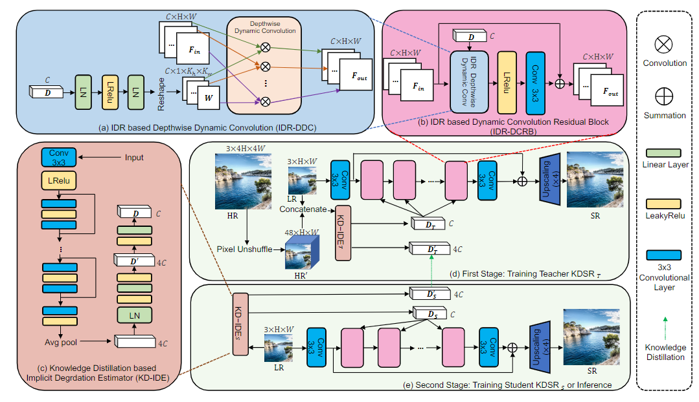

# KDSR-classic


This project is the official implementation of 'Knowledge Distillation based Degradation Estimation for Blind Super-Resolution', ICLR2023
> **Knowledge Distillation based Degradation Estimation for Blind Super-Resolution [[Paper](https://arxiv.org/pdf/2211.16928.pdf)] [[Project](https://github.com/Zj-BinXia/KDSR)]**

This is code for KDSR-class (for classic degradation model, ie y=kx+n)

<p align="center">
  
</p>

---

##  Dependencies and Installation

- Python >= 3.8 (Recommend to use [Anaconda](https://www.anaconda.com/download/#linux) or [Miniconda](https://docs.conda.io/en/latest/miniconda.html))
- [PyTorch >= 1.10](https://pytorch.org/)

## Dataset Preparation

We use DF2K, which combines [DIV2K](https://data.vision.ee.ethz.ch/cvl/DIV2K/) (800 images) and [Flickr2K](https://github.com/LimBee/NTIRE2017) (2650 images).

---

## Training (4 V100 GPUs)

### Isotropic Gaussian Kernels

1. We train KDSRT-M ( using L1 loss)

```bash
sh main_iso_KDSRsMx4_stage3.sh 
```

2. we train KDSRS-M (using L1 loss and KD loss). **It is notable that modify the ''pre_train_TA'' and ''pre_train_ST'' of main_iso_KDSRsMx4_stage4.sh  to the path of trained KDSRT-M checkpoint.** Then, we run

```bash
sh main_iso_KDSRsMx4_stage4.sh 
```

---

## :european_castle: Model Zoo

Please download checkpoints from [Google Drive](https://drive.google.com/drive/folders/113NBvfcrCedvend96KqDiRYVy3N8yprl).

---
## Results
<p align="center">
  
</p>


---

## BibTeX

    @InProceedings{xia2022knowledge,
      title={Knowledge Distillation based Degradation Estimation for Blind Super-Resolution},
      author={Xia, Bin and Zhang, Yulun and Wang, Yitong and Tian, Yapeng and Yang, Wenming and Timofte, Radu and Van Gool, Luc},
      journal={ICLR},
      year={2023}
    }


## Acknowledgements
This code is built on [EDSR (PyTorch)](https://github.com/thstkdgus35/EDSR-PyTorch), [IKC](https://github.com/yuanjunchai/IKC). We thank the authors for sharing the codes.

## 📧 Contact
If you have any question, please email `zjbinxia@gmail.com`.

