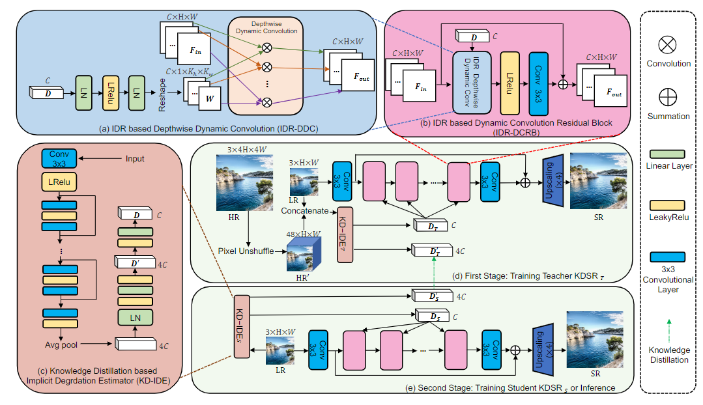

# KDSR

This project is the official implementation of 'Knowledge Distillation based Degradation Estimation for Blind Super-Resolution', ICLR2023
> **Knowledge Distillation based Degradation Estimation for Blind Super-Resolution [[Paper](https://arxiv.org/pdf/2211.16928.pdf)] [[Project](https://github.com/Zj-BinXia/KDSR)]**

We provide [Pretrained Models](https://drive.google.com/drive/folders/1_LyZDLu5dNIBaCSu7oB9w9d1SPf1pm8c?usp=sharing) for KDSR-classic (for classic degradation models) and KDSR-GAN (for Real-world SR)

<p align="center">
  
</p>

---

##  Dependencies and Installation

- Python >= 3.8 (Recommend to use [Anaconda](https://www.anaconda.com/download/#linux) or [Miniconda](https://docs.conda.io/en/latest/miniconda.html))
- [PyTorch >= 1.10](https://pytorch.org/)

### Installation

1. Clone repo

    ```bash
    git clone git@github.com:Zj-BinXia/KDSR.git
    ```

2. Install dependent packages

    ```bash
    # Install basicsr - https://github.com/xinntao/BasicSR
    # We use BasicSR for both training and inference
    pip install basicsr
    # facexlib and gfpgan are for face enhancement
    pip install facexlib
    pip install gfpgan
    pip install -r requirements.txt
    python setup.py develop
    ```

---
